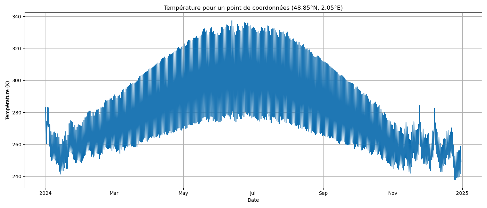

### Projet CREP

***

| Les chevreaux brillants |
|-------------|

  
<strong>Comment se repérer dans nos fichiers ?</strong>

Notre projet est divisé en plusieurs dossiers, représentant les différentes évolutions du modèle, numérotées de 1 à 6.  
Dans chacun de ces dossiers, vous trouverez un fichier PDF, résumant les avancées de ce modèle (par rapport aux versions précédentes), ainsi qu'un code Python associé.  

Il peut être nécessaire d'installer sur Python les librairies suivantes :  
`numpy`, `matplotlib`, `datetime`, `math`, `requests`, `shapely.geometry`, `mpl_toolkits.basemap`.

---

  
<strong>Comment utiliser notre code ?</strong>

Dans un premier temps, il faut exécuter le fichier MAIN.py, situé dans le dossier "modèle 6". Dans la console, trois questions successives apparaissent, demandant de renseigner la latitude, longitude du point choisi, et l'année d'étude. Ce code, en s'appuyant sur les fichiers 'parametrage_convection.py', 'parametrage_surface.py' et 'librairies_puissances'.

👉 Voici un exemple pour la ville de Paris (48.85°N, 2.05°E) en 2024 :

---

  
<strong>Nos différents modèles :</strong>

- <kbd><a href="https://github.com/Pierregb1/CREP/tree/main/Mod%C3%A8le%201">MODELE 1</a></kbd> : Baisse de température la nuit via la loi de Newton et le premier principe.  
- <kbd><a href="https://github.com/Pierregb1/CREP/tree/main/Mod%C3%A8le%202">MODELE 2</a></kbd> : Évolution de la température selon la loi de Stefan.  
- <kbd><a href="https://github.com/Pierregb1/CREP/tree/main/Mod%C3%A8le%203">MODELE 3</a></kbd> : Albédo variable selon latitude/longitude via API.  
- <kbd><a href="https://github.com/Pierregb1/CREP/tree/main/Mod%C3%A8le%204">MODELE 4</a></kbd> : Coefficient de conducto-convexion variable dans le temps.  
- <kbd><a href="https://github.com/Pierregb1/CREP/tree/main/Mod%C3%A8le%205">MODELE 5</a></kbd> : Capacité thermique variable selon eau, glace, terre.  
- <kbd><a href="https://github.com/Pierregb1/CREP/tree/main/Mod%C3%A8le%206">MODELE 6</a></kbd> : Coefficient alpha variable selon le CO₂ atmosphérique.

---

  
<strong>Pistes pour l'année prochaine :</strong>

Il est clair que certaines puissances cédées par la Terre, et non négligeables, n'ont pas été modélisées par notre groupe.  
Parmi ces dernières, on retrouve notamment l'évapo-transpiration : nous avons effectué des recherches, mais nous ne les avons pas intégrées dans le code.

👉 <kbd><a href="https://github.com/Pierregb1/CREP/blob/main/Pistes%20futures/Mode%CC%80le_e%CC%81vapotranspiration.pdf">À retrouver ici</a></kbd>

***
